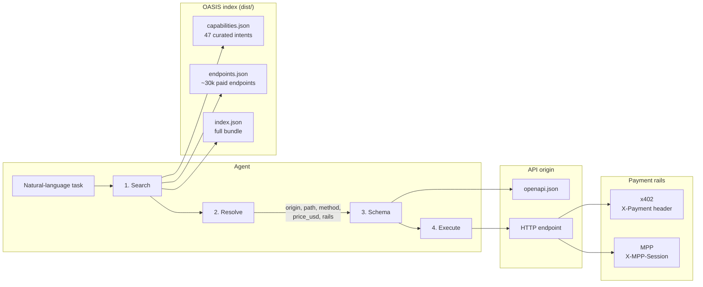
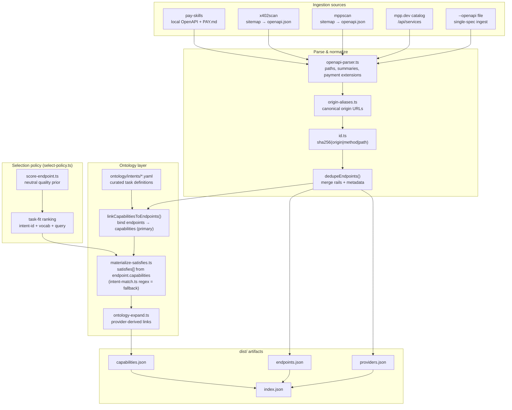
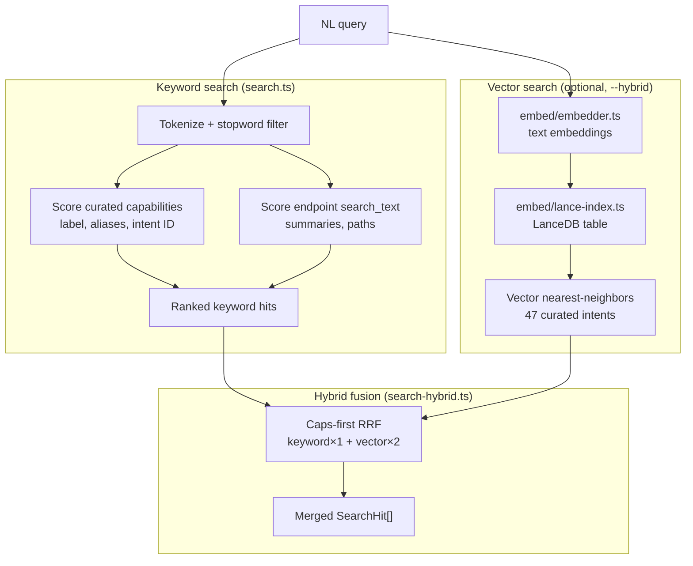
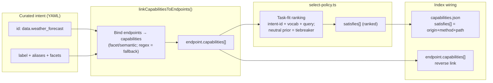
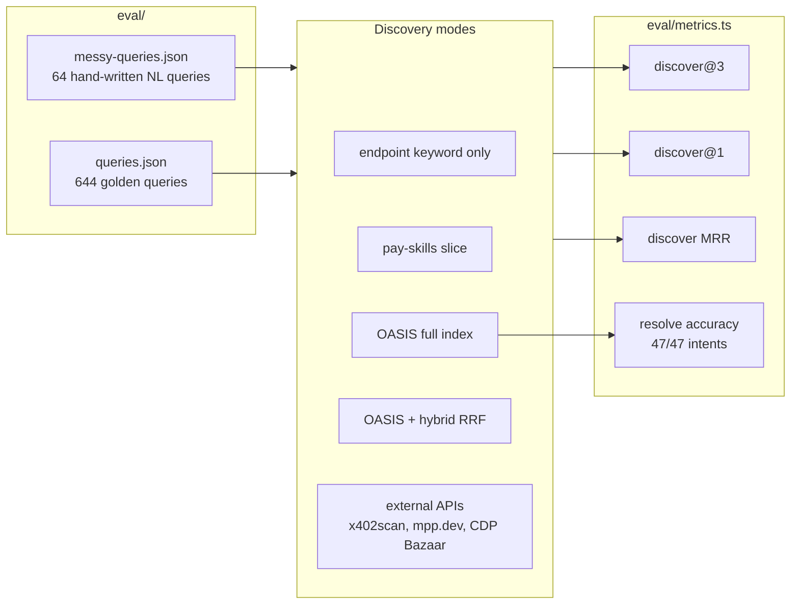

# OASIS Architecture

High-level design of how OASIS discovers paid HTTP APIs (x402 and MPP) for agentic commerce.
This describes the **current** index-build + traversal implementation; for the direction the
project is heading (endpoint-atomic retrieval, the one-hop `oasis_find`, LLM-assisted
distributed curation), see [docs/scaling.md](docs/scaling.md).

## Agent traversal protocol

Agents use progressive disclosure: search globally, resolve one endpoint, fetch schema on demand, then execute with the right payment rail.



| Step | Input | Output | Source |
|------|-------|--------|--------|
| Search | NL query | Ranked intents + endpoints | `capabilities.json`, `endpoints.json` |
| Resolve | Intent ID or endpoint ID | Concrete origin, path, payment metadata | Index record + `satisfies[]` wiring |
| Schema | Origin + path | Request/response JSON Schema | `{origin}/openapi.json` (not duplicated in index) |
| Execute | Full URL + body | API response | x402 or MPP client |

---

## Index build pipeline

The reference CLI (`capindex build`) ingests public catalogs, normalizes them into a flat endpoint index, and wires curated task intents from the ontology.



**Key design choices**

- **Origin-centric IDs** — `sha256(origin|method|path)`; no vendor-specific ID logic.
- **Ingest, don't own** — pull from pay-skills, x402scan, mppscan, mpp.dev; publish neutral `dist/`.
- **OpenAPI is source of truth** — index holds summaries and payment facets, not full schemas.
- **Payment rails as siblings** — x402 and MPP live under `payment.rails[]` on each endpoint.

---

## Search & retrieval

Search maps a natural-language task to ranked capability intents (and optionally raw endpoints). Hybrid mode fuses keyword and vector recall.



**Search hit kinds**

| `kind` | Meaning |
|--------|---------|
| `capability` | Curated task intent — preferred entry point for resolve |
| `endpoint` | Direct endpoint row — fallback when no intent matches |

Capability hits carry a `capability_id`; resolve expands `satisfies[]` into concrete endpoints ranked by **task fit** (intent-id + label/alias vocabulary + the query), with the neutral quality prior as a tiebreaker.

---

## Ontology → endpoint wiring

Curated intents are provider-agnostic task definitions. Endpoints are bound to capabilities
primarily by `linkCapabilitiesToEndpoints()` (a facet/semantic binding over the whole index,
written onto each endpoint as `endpoint.capabilities[]`). `materialize-satisfies.ts` derives
each intent's `satisfies[]` from that binding — the legacy per-intent regex matchers in
`intent-match.ts` are a **fallback**, used only on the first build pass before the binding is
populated. A full build re-materializes `satisfies[]` after the binding is set; the offline
`enrich-facets` pass does the same without re-ingesting.



**Resolve path** (`capindex resolve --intent <id>`, and the `oasis_find` server tool):

1. Load the intent and map its `satisfies[]` to concrete endpoints via `sha256(origin|method|path)`.
2. Rank by **task fit** (`resolveEndpointsForQuery`): intent-id tokens (`weather_forecast`
   → weather/forecast) dominate, matched against each endpoint's own summary/path, plus the
   label/alias vocabulary and the user query; the neutral quality prior only breaks ties.
3. Return origin, path, `payment.rails`, `price_usd`, `openapi_url`.

---

## Evaluation harness

Benchmarks measure whether `search → resolve` finds the right paid API for natural-language queries.



---

## Project layout

```
spec/                  JSON schemas + traversal protocol
ontology/intents/      Curated capability definitions (YAML)
src/                   Indexer, CLI, search, embed, eval, validate (TypeScript)
dist/                  Built artifacts (endpoints, capabilities, index)
eval/                  Benchmark query sets
mcp/                   Reference MCP server (oasis_find + contribution tools), agent probe, A/B harness
docs/                  Benchmarks, scaling thesis, contribution guide
```

The full benchmark suite (curated, held-out generalization, multi-label, and the end-to-end
agent probe / token-cost A/B) is documented in [docs/eval_results.md](docs/eval_results.md).
See [spec/traversal.md](spec/traversal.md) for the agent protocol, [README.md](README.md) for
CLI usage, and [docs/scaling.md](docs/scaling.md) for the architecture direction.