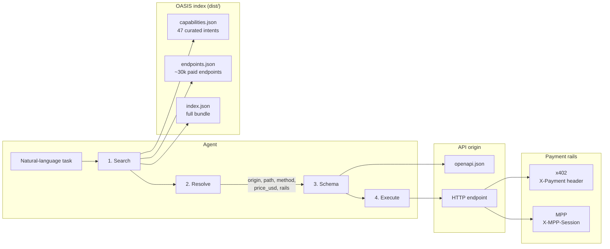
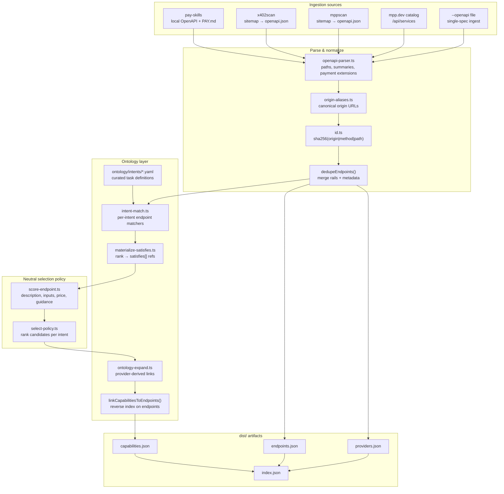
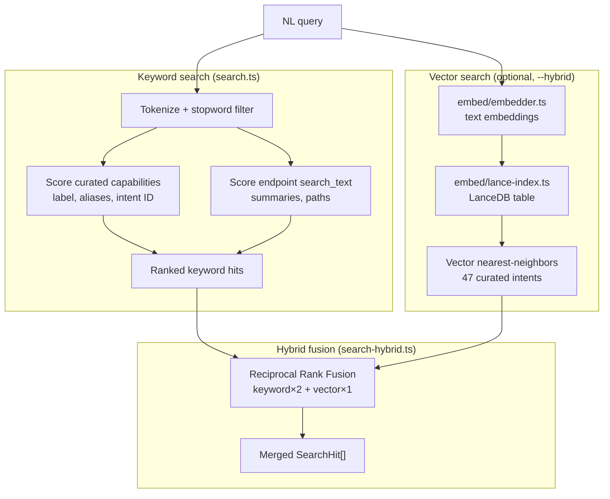
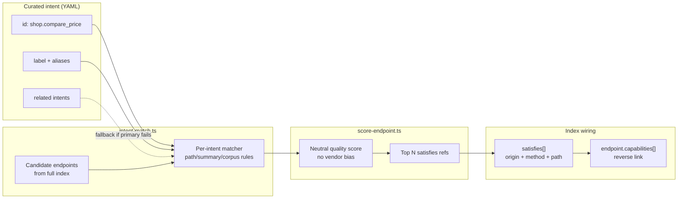
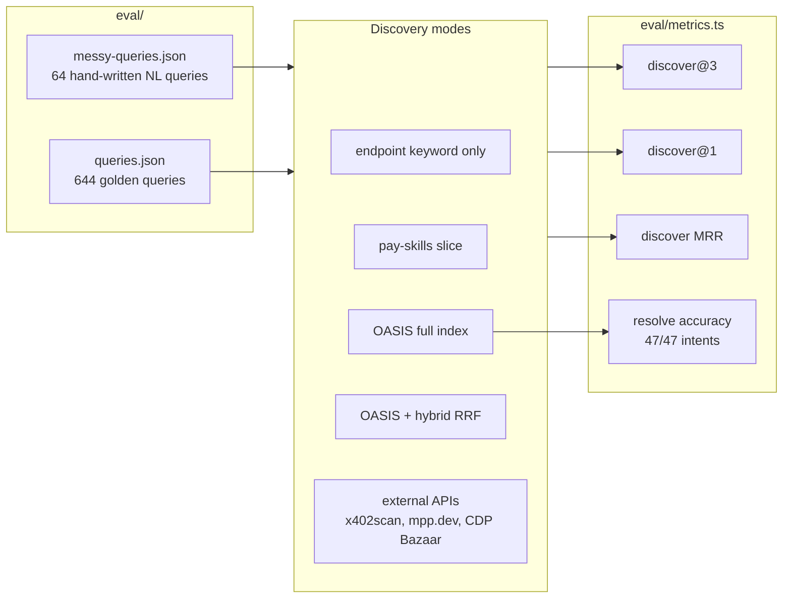

# OASIS Architecture

High-level design of how OASIS discovers paid HTTP APIs (x402 and MPP) for agentic commerce.

## Agent traversal protocol

Agents use progressive disclosure: search globally, resolve one endpoint, fetch schema on demand, then execute with the right payment rail.



| Step | Input | Output | Source |
|------|-------|--------|--------|
| Search | NL query | Ranked intents + endpoints | `capabilities.json`, `endpoints.json` |
| Resolve | Intent ID or endpoint ID | Concrete origin, path, payment metadata | Index record + `satisfies[]` wiring |
| Schema | Origin + path | Request/response JSON Schema | `{origin}/openapi.json` (not duplicated in index) |
| Execute | Full URL + body | API response | x402 or MPP client |

---

## Index build pipeline

The reference CLI (`capindex build`) ingests public catalogs, normalizes them into a flat endpoint index, and wires curated task intents from the ontology.



**Key design choices**

- **Origin-centric IDs** — `sha256(origin|method|path)`; no vendor-specific ID logic.
- **Ingest, don't own** — pull from pay-skills, x402scan, mppscan, mpp.dev; publish neutral `dist/`.
- **OpenAPI is source of truth** — index holds summaries and payment facets, not full schemas.
- **Payment rails as siblings** — x402 and MPP live under `payment.rails[]` on each endpoint.

---

## Search & retrieval

Search maps a natural-language task to ranked capability intents (and optionally raw endpoints). Hybrid mode fuses keyword and vector recall.



**Search hit kinds**

| `kind` | Meaning |
|--------|---------|
| `capability` | Curated task intent — preferred entry point for resolve |
| `endpoint` | Direct endpoint row — fallback when no intent matches |

Capability hits carry a `capability_id`; resolve expands `satisfies[]` into concrete endpoints ranked by neutral quality signals.

---

## Ontology → endpoint wiring

Curated intents are provider-agnostic task definitions. At build time, matchers find candidate endpoints; neutral scoring picks the best `satisfies` refs.



**Resolve path** (`capindex resolve --intent <id>`):

1. Load intent from `capabilities.json`.
2. Map each `satisfies` ref to an endpoint via `sha256(origin|method|path)`.
3. Return origin, path, `payment.rails`, `price_usd`, `openapi_url`.

---

## Evaluation harness

Benchmarks measure whether `search → resolve` finds the right paid API for natural-language queries.



---

## Project layout

```
spec/                  JSON schemas + traversal protocol
ontology/intents/      Curated capability definitions (YAML)
src/                   Indexer, CLI, search, embed, eval (TypeScript)
dist/                  Built artifacts (endpoints, capabilities, index)
eval/                  Benchmark query sets
```

See [spec/traversal.md](spec/traversal.md) for the agent protocol and [README.md](README.md) for CLI usage and benchmark results.