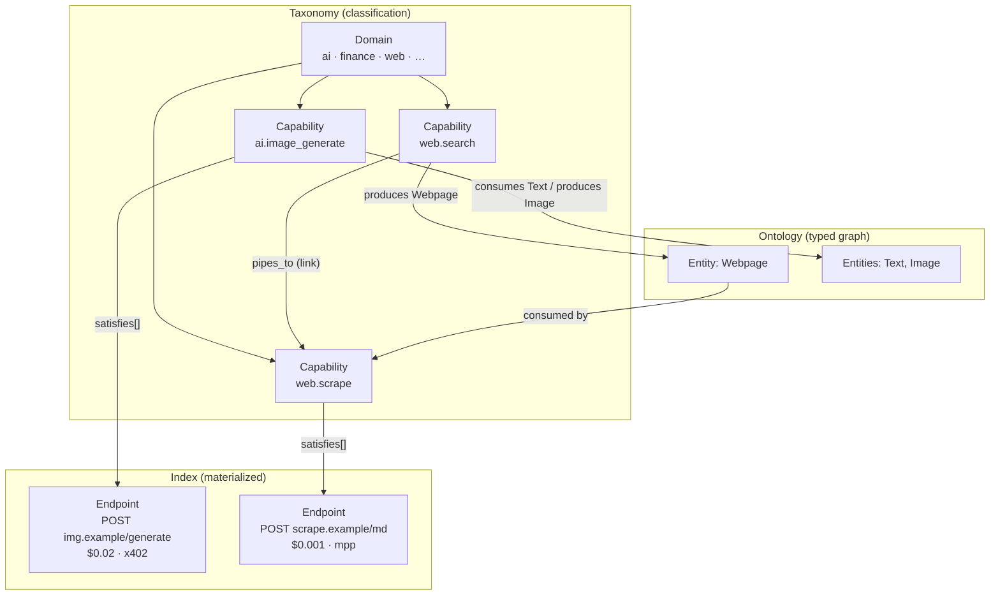

# OASIS Concepts

A mental-model doc for the OASIS data model. It defines the core concepts — **taxonomy**,
**ontology**, **capability/intent**, **domain**, **facet**, **entity**, **link**,
**endpoint**, **binding**, and **satisfies** — and shows how they fit together, grounded in
the actual schemas and intent files. Read this before contributing a capability or reading
the index.

For the pipeline and traversal design see [ARCHITECTURE.md](../ARCHITECTURE.md); for the
authoring rules see [docs/contributing-capabilities.md](contributing-capabilities.md).

## Quick glossary

| Term | One-line definition | Lives in |
|------|--------------------|----------|
| **Taxonomy** | The classification layer: the closed set of **domains** + the controlled vocabulary of **capabilities**. | `ontology/intents/`, facet enums in `spec/*.schema.json` |
| **Ontology** | The typed *graph*: capabilities as nodes, with **entity** producer→consumer edges and typed **links** between them. | `ontology/intents/`, `spec/entity-vocab.json` |
| **Capability / intent** | A vendor-neutral task an agent wants to do. `id = <domain>.<snake_name>`. | `ontology/intents/<name>.yaml` |
| **Domain** | Top-level grouping facet; a closed, evolving enum. Load-bearing, not cosmetic. | `facets.domain` |
| **Facet** | One of four classification axes: `domain`, `action`, `modality`, `freshness`. | `facets` block |
| **Entity** | A typed noun from a closed vocabulary that a capability `consumes` / `produces`. | `spec/entity-vocab.json` |
| **Port** | One `consumes`/`produces` slot: an entity + a `role` + optional `format`/`cardinality`. | `consumes[]`, `produces[]` |
| **Link** | A typed edge between two capabilities (`sibling_of`, `pipes_to`, …). | `links[]` |
| **Endpoint** | A concrete paid HTTP endpoint (origin + method + path) with price + payment rails. | `dist/endpoints.json` |
| **Binding** | The build step that attaches endpoints to capabilities by semantic similarity. | `src/embed/bind-endpoints.ts` |
| **`satisfies[]`** | The materialized capability→endpoint list, derived from bindings. | `dist/capabilities.json` |

---

## The two layers: taxonomy vs ontology

OASIS is two layers over the same set of curated task files.

- The **taxonomy** is the *classification*. It answers "what kinds of tasks exist, and how are
  they grouped?" Concretely: the closed set of **domains** (`ai`, `finance`, `blockchain`, …)
  and the controlled vocabulary of **capabilities** (one YAML per task in
  `ontology/intents/`). It is a flat, curated dictionary — the words an agent is allowed to
  route to.

- The **ontology** is the *typed graph* built from those same capabilities. Each capability is
  a node that **consumes** and **produces** typed **entities**, and carries typed **links** to
  other capabilities. Those two edge kinds — entity producer→consumer adjacency and explicit
  typed links — turn the flat dictionary into something traversable: "what task produces the
  input this task needs?", "what's a substitute for this?", "what comes next?".

Same files, two readings: read `facets.domain` + the capability list and you have a taxonomy;
read `consumes`/`produces` + `links` and you have an ontology.



---

## Capability (intent)

A **capability** (used interchangeably with **intent**) is a vendor-neutral definition of *a
task an agent wants to do* — "generate an image from a prompt", "enrich a company from a
domain" — never a specific vendor's product. One file per capability in `ontology/intents/`.

- **ID:** `<domain>.<snake_name>`, e.g. `ai.image_generate`, `identity.company_enrich`,
  `web.search`. The filename is hyphenated (`ai.image-generate.yaml`); the `id:` inside is
  snake_case. The domain prefix is not decoration — it is the single strongest signal in
  serve-time ranking (see [Binding](#binding-and-satisfies)).
- **Authored vs materialized.** There are *two* schemas for a capability:
  - `spec/ontology-source.schema.json` — what a **contributor authors**. Task-only: `id`,
    `label`, `description`, `aliases`, `consumes`/`produces`, `facets`, `links`. **No
    `satisfies`** — you never hand-write which endpoints serve a task.
  - `spec/capability.schema.json` — the **built** shape in `dist/capabilities.json`. Same
    fields **plus a required `satisfies[]`**, materialized at index-build time.

A real authored capability (`ontology/intents/ai.image-generate.yaml`):

```yaml
id: ai.image_generate
label: Generate an image from a text prompt
description: Text-to-image generation via AI models. Use when an agent must render a NEW
  visual asset from a natural-language prompt — not image analysis, captioning, or editing.
aliases:
  - generate image
  - text to image
  - render a picture from prompt
consumes:
  - { entity: Text, role: identifier }      # the prompt is the input key
produces:
  - { entity: Image, role: payload, format: png }
facets:
  domain: ai
  action: generate
```

`description` and `aliases` are for **discovery only** — they do not drive ranking. Ranking is
by objective signals (task fit, schema completeness, price sanity). Inflated copy buys nothing;
see [docs/contributing-capabilities.md](contributing-capabilities.md).

---

## Domain

The **domain** is the top-level grouping facet — a single closed enum value on every
capability. It is the coarsest axis of the taxonomy.

**The live working set (~20 domains):**

```
agent · ai · blockchain · cloud · commerce · comms · compute · data · devtools · finance
gov · identity · maps · media · realestate · science · social · travel · utility · web
```

Treat this as a **living set**, not a constant. It is governed by a **≥3-independent-provider
rule**: a domain (or a capability) earns its place only when at least three independent
providers offer that kind of task — the guard against fragmenting into 1,000 near-duplicate
buckets (the anti-fragmentation stance in
[docs/contributing-capabilities.md](contributing-capabilities.md)). The most recent refactor
grew the set to 20: `shop` became **`commerce`**, **`science`** and **`gov`** were added, and
**`data`** was pared back to generic reference lookups. The `domain` enum committed in
`spec/capability.schema.json`, `spec/ontology-source.schema.json`, and
`spec/endpoint-record.schema.json` is the source of truth and matches the live set above (and
`oasis_taxonomy`).

**Domain is load-bearing, not cosmetic.** It shapes discovery in three ways:

1. **Resolve discriminator.** The intent id's non-domain tokens are the primary serve-time
   ranking signal, and the domain prefix scopes them (`src/bind/select-policy.ts`,
   `intentIdTokens`).
2. **Binding signal.** `facets.domain` (and `facets.action`) are folded into the text that is
   embedded for each capability (`src/embed/lance-index.ts`, `capabilityEmbedText`), so domain
   influences which endpoints bind.
3. **Serve-time adjacency gate.** An optional, env-gated domain-compatibility penalty
   (`src/bind/select-policy.ts`, `DOMAIN_COMPAT`) down-weights endpoints whose *authored*
   domain conflicts with the routed intent's, with a deliberately tight cross-domain map
   (`travel`↔`maps`, `finance`↔`blockchain`). It fires only on authored facets, so unlabeled
   endpoints are untouched.

---

## Facets

**Facets** are the four classification axes on a capability. Together they place a task in the
taxonomy along orthogonal dimensions. Enum values below are from
`spec/capability.schema.json`.

| Facet | What it captures | Values |
|-------|-----------------|--------|
| **`domain`** | Subject-area grouping (see above). | the ~20 live domains |
| **`action`** | The verb — what the task *does*. | `search`, `lookup`, `compare`, `extract`, `generate`, `transform`, `validate`, `send`, `provision`, `analyze`, `execute`, `monitor` |
| **`modality`** | Output shape(s); an **array**. | `text`, `html`, `markdown`, `json`, `image`, `audio`, `vector`, `citations`, `timeseries` |
| **`freshness`** | Time character of the result. | `realtime`, `recent`, `historical`, `forecast`, `static` |

Only `domain` is effectively always present; the rest are added where they discriminate. For
example `blockchain.rpc` sets `action: execute` + `freshness: realtime`, while
`ai.image_generate` sets only `domain: ai` + `action: generate`. Facets are a *soft* signal:
`domain`/`action` feed the capability embedding, and there are optional (env-gated, authored-
only) `action`/`domain`/`entity` compatibility penalties at serve time — none are hard filters
by default.

---

## Entity

An **entity** is a typed noun from a **closed controlled vocabulary** in
`spec/entity-vocab.json` (`spec_version` 0.3.0). Entities are what capabilities pass around. A
capability declares typed **ports**:

- **`consumes[]`** — the entities it takes as input.
- **`produces[]`** — the entities it returns.

Each port is `{ entity, role, format?, cardinality? }`:

- **`entity`** — must be a name in the closed vocab (e.g. `Text`, `Image`, `Company`,
  `Domain`, `Webpage`, `Query`).
- **`role`** — `identifier` (a key you supply/return), `payload` (the content itself), or
  `constraint` (a filter/bound). The role is **contextual to this capability**: the prompt
  `Text` in `ai.image_generate` is tagged `role: identifier` (it's the request key) even though
  `Text` is a `payload` noun in the vocab. The vocab's own `role` is a canonical default; the
  port's `role` is how the entity functions *here*.
- **`cardinality`** — `one` (default) or `many` (e.g. `web.search` produces many
  `SearchResults`).

Vocab entries also carry a `kind` (`identity` vs `observation`), optional `schema_org`
mappings, an `absorbs` list (near-duplicate entities folded in — e.g. `PriceSignal` absorbs
`PriceQuote`/`PriceHistory`/`InflationTrend`), `deprecated`/`absorbed_by` markers, and a
`bridge_eligible` flag (lateral-planning seeds; identity entities only).

**Entities are what make the ontology a graph.** A capability that *produces* entity `X` is
adjacent to any capability that *consumes* entity `X`. That producer→consumer adjacency is the
backbone of chaining and backward planning ("to get an embedding, first produce `Text`"). For
example:

```
web.search   produces  Webpage  ─┐
                                 ├─►  web.scrape   consumes  Webpage   (search → then fetch)
ai.ocr       produces  Text     ─┘                ai.embeddings consumes Text  (ocr → embed)
```

---

## Links

A **link** is an explicit, typed edge between two capabilities — the ontology's hand-authored
relationships, complementing the implicit entity adjacency. Authored in the `links[]` block as
`{ type, to, note }`, where `to` is an existing capability id. Six link types
(`spec/capability.schema.json`):

| Type | Meaning | Agent-facing label |
|------|---------|--------------------|
| `alternative_of` | A substitute for the same task. | *alternative* |
| `sibling_of` | Same family; differs by entity/purpose/action. | *related* |
| `broader_of` | The target is a **narrower** variant of this one. | *more specific* |
| `narrower_of` | The target is a **broader** variant of this one. | *more general* |
| `pipes_to` | The target is a natural **next step** (this task's output feeds it). | *next step* |
| `fed_by` | The target is a **prior step** (it produces this task's input). | *prior step* |

Direction reads "the target from *this* node's perspective": `web.search broader_of
ai.web_research` means web.search is broader, so `ai.web_research` is offered as the *more
specific* option (`src/search/related.ts`, `RELATION_LABEL`).

**Inverses are auto-generated** at build time (`src/bind/materialize-satisfies.ts`,
`addInverseLinks`), so the graph is bidirectional and you author each edge once:

| Authored | Generated on the target |
|----------|------------------------|
| `pipes_to` | `fed_by` |
| `broader_of` | `narrower_of` |
| `narrower_of` | `broader_of` |
| `sibling_of` | `sibling_of` |
| `alternative_of` | `alternative_of` |

Authored links always win the dedup; a generated inverse is only added if the target has no
edge back to the source (`fed_by` is not itself a source key, so an inverse never spawns
another). A legacy untyped `related[]` id list, if present, is coerced to `sibling_of` links.

Links power the resolve response's `related[]` neighborhood — the pivot set an unsure agent
uses to substitute, re-scope, or chain (see [spec/traversal.md](../spec/traversal.md)). Real
example from `ontology/intents/web.search.yaml`:

```yaml
links:
  - type: broader_of
    to: ai.web_research   # web.search = raw SERP; web_research = the narrower cited-answer variant
  - type: pipes_to
    to: web.scrape        # search the web, then fetch/scrape the result URLs
```

---

## Endpoint

An **endpoint** is a concrete, callable **paid HTTP endpoint** — the atomic unit OASIS
actually routes to. Shape in `spec/endpoint-record.schema.json`; ~19k of them ship in
`dist/endpoints.json`.

- **Identity:** `id = sha256(origin | method | path)` — origin-centric, no vendor-specific ID
  logic. `origin` (base URL) + `method` (`GET`/`POST`/…) + `path`.
- **Payment** (`payment`): `price_usd`, and `rails[]` — each rail is `{ protocol: "x402" |
  "mpp", version?, networks? }`. x402 (wallet-signed `X-Payment` header) and MPP (hosted
  `X-MPP-Session`) are siblings under `rails[]`; an endpoint may accept either or both.
- **Provenance:** discovered by federating public registries (CDP x402 Bazaar, mpp.dev,
  pay.sh, x402scan), then enriching each origin's `/openapi.json`. A quality gate drops stubs,
  meta paths, and too-thin records before they enter the index.
- **Schemas live at the origin, not in the index.** The record holds a `summary`,
  `search_text`, derived `facets`, and `openapi_url` — full request/response JSON Schema is
  fetched on demand from `{origin}/openapi.json` (OpenAPI is the source of truth).
- **`capabilities[]`** — the reverse link: the curated intent id(s) this endpoint was bound to.
  This is set by binding (next section) and is the inverse of `satisfies[]`.

Endpoints also cache **derived facets** (`facets.domain`, `primary_entity`, `output_entity`,
`modality`) — a regex/heuristic read of the path/summary, explicitly *not* new information and
noisier than authored capability facets.

---

## Binding and `satisfies`

Capabilities are provider-agnostic task definitions; endpoints are concrete. **Binding** is the
build step that connects them, and **`satisfies[]`** is the materialized result.

**Binding** (`src/embed/bind-endpoints.ts`, run during `enrich-facets`) is **semantic**, not
hand-wired. Every endpoint and every curated capability is embedded (`gemini-embedding-001`),
then each endpoint binds to the capability whose vectors are closest, subject to floors:

- **Dense floor** — cosine must clear a minimum (gemini's cosine scale is compressed, so a bare
  argmax is unreliable).
- **Sparse (TF-IDF) arm** — an embedder-independent lexical signal that breaks near-ties
  ("eth_call" → RPC) and **gates** endpoints sharing no task vocabulary with any near
  capability (payment-boilerplate, price-strings).
- **Strong-sparse promotion** — rescues an endpoint below the dense floor when its lexical
  match to a capability is strong (the orphan-rescue path). Strictly additive: it never
  displaces a dense binding.
- **Discrimination margin** — orphans an ambiguous near-tie with weak lexical overlap rather
  than mis-binding it (the "spill" guard).

The result is written onto each endpoint as `endpoint.capabilities[]`. Binding is semantic-only
— there is no domain hard-gate at bind time (the legacy regex matchers are gone); domain
influences it only via the capability embed text.

**`satisfies[]`** is then **materialized** from those bindings
(`src/bind/materialize-satisfies.ts`): for each capability, collect every endpoint whose
`capabilities[]` includes its id, keep a generous pool (up to 50), and write them as
`SatisfiesRef` entries (`{ origin, method, path, source }`). Today every ref is tagged `source:
match_hint` (materialized), though the schema also allows `curated` / `facet-gate`. So
`satisfies[]` and `endpoint.capabilities[]` are two views of the same binding — capability→
endpoints and endpoint→capabilities.

**Serve-time ranking** (`resolveEndpointsForQuery` in `src/bind/select-policy.ts`) is a
*separate* step from binding. When an agent resolves a capability, its `satisfies[]` pool is
ranked against the actual query by **task fit**: intent-id tokens dominate, then label/alias
vocabulary, then query overlap; a neutral structural-quality prior (documented + has an input
schema) only breaks ties. Two precision layers sit on top: a **catch-all (breadth) penalty**
that demotes mega-hosts bound to many intents *only when they have zero id-token match*, and a
**semantic rescue** that lifts a specialist buried by a synonym gap (gated to low-breadth
hosts). The optional domain/action/entity compatibility penalties described under
[Domain](#domain) apply here too. Ranking never reads the self-description.

---

## How it all connects

**Worked example — a single task, traced end to end.**

An agent has: *"make me a picture of a red fox in a snowy forest."*

1. **NL task → capability.** Search classifies the query against the curated capabilities. The
   `action: generate` + `modality: image` facets and the aliases ("text to image", "render a
   picture from prompt") route it to **`ai.image_generate`** — in the **`ai`** domain. (The
   agent got here without knowing any vendor name; that's the point of the taxonomy.)
2. **Capability → endpoints via `satisfies[]`.** Resolving `ai.image_generate` expands its
   materialized `satisfies[]` pool — every endpoint the semantic **binder** attached to it —
   and ranks them by task fit against the query.
3. **Endpoint → payment rail.** The top endpoint resolves to a concrete `origin` + `POST`
   `path`, a `price_usd`, and `payment.rails[]`. A wallet-native agent picks the `x402` rail; a
   wallet-less one filters for `mpp`. It fetches `{origin}/openapi.json` for the request schema,
   then executes.
4. **Entity check.** `ai.image_generate` **consumes** `Text` (the prompt) and **produces**
   `Image` — so the agent knows it feeds a prompt string and gets back an image, before reading
   a single schema.

**Cross-capability next step — following the graph.** Say the agent instead started from a
photo and ran **`ai.ocr`** (`consumes: Image`, `produces: Text`). Two ontology edges tell it
what's reachable next:

- A **typed link**: `ai.ocr pipes_to ai.translate_text` surfaces "translate the extracted
  text" as the *next step* in the resolved `related[]` (and the auto-generated
  `ai.translate_text fed_by ai.ocr` inverse lets an agent holding only untranslated text plan
  *backward* to OCR).
- An **entity edge**: because `ai.ocr` **produces** `Text` and `ai.embeddings` **consumes**
  `Text`, the two are adjacent — the agent can chain OCR → embed for retrieval without any
  hand-authored link at all.

That is the whole model in one trace: a **domain**/**facet**-classified **capability** found by
natural language, **bound** to priced **endpoints** via **`satisfies[]`**, executed over a
**payment rail**, and extended across the graph by **entity** adjacency and typed **links**.

---

## Where each concept lives

| Concept | Definitive source |
|---------|-------------------|
| Capability shape (authored) | `spec/ontology-source.schema.json` |
| Capability shape (materialized) | `spec/capability.schema.json` |
| Facet enums (`domain`/`action`/`modality`/`freshness`) | `spec/capability.schema.json` `$defs.Facets` |
| Entity vocabulary | `spec/entity-vocab.json` |
| Endpoint record | `spec/endpoint-record.schema.json` |
| Real capabilities | `ontology/intents/*.yaml` |
| Binding logic | `src/embed/bind-endpoints.ts` |
| `satisfies[]` materialization + inverse links | `src/bind/materialize-satisfies.ts` |
| Serve-time ranking / domain gates | `src/bind/select-policy.ts` |
| Related-links neighborhood | `src/search/related.ts` |
| Traversal protocol (search → resolve → schema → execute) | `spec/traversal.md` |
| Authoring rules | `docs/contributing-capabilities.md` |
